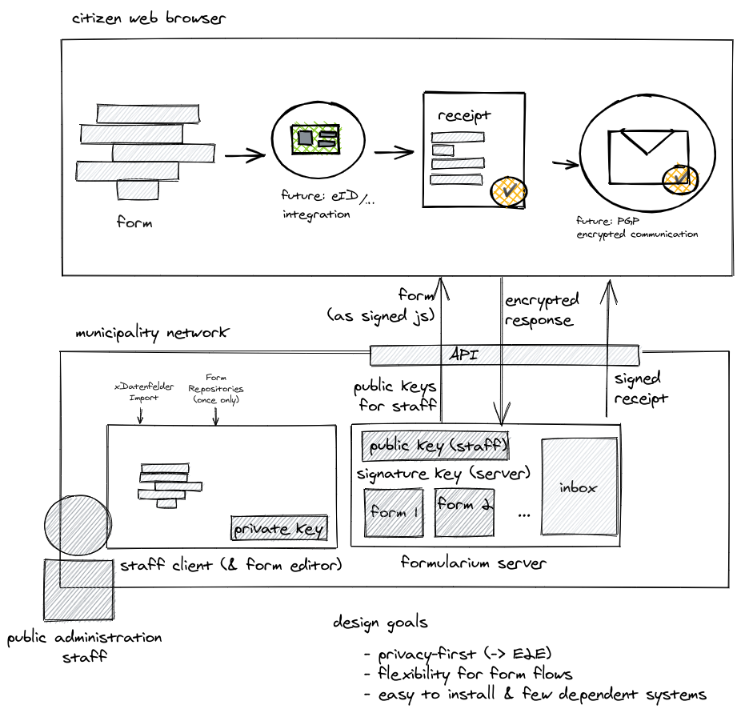

# Formularium α
> :warning: **Formularium is still under heavy development! If you are interested in learning more about formularium or even want to contribute, consider [joining our slack channel](https://join.slack.com/t/formularium/shared_invite/zt-ooxr8hzr-LMYSF93V~sLwqYaQwiEACg)** 

### About
Formularium is a FOSS, privacy-first, and user-friendly toolkit for small to medium-sized municipalities (1-150k inhabitants) to support them in making their public services available online.

**Why?**: We feel that municipalities are a backbone to democracy but often are left behind when extending the democratic government to the digital world. We think that neither existing vendors nor the federal government provides the software components and the concepts needed to digitize municipalities’ processes.

So we decided to build open-source concepts and software to allow municipalities to develop their dynamic forms themselves.

### Features
- Form editor based on the visual programming language blockly. This allows you to build almost any kind of validation/routing logic into your forms without writing a single line of code. 
- Security by Design with End-to-End encryption. Every form gets PGP-encrypted before it will be submitted to the backend. Only the administrative staff can decrypt form data locally.
- Proof of transmission: The applicant gets a digitally signed receipt that the server has received their form.

### High Level Architecture


### Related Projects
- [Formularium Backend](https://github.com/LilithWittmann/formularium-backend)
- [Formularium Desktop](https://github.com/LilithWittmann/formularium-desktop)

## Project setup
```
npm install
```

### Compiles and hot-reloads for development
```
npm run serve
```

### Compiles and minifies for production
```
npm run build
```

### Run your tests
```
npm run test
```

### Lints and fixes files
```
npm run lint
```

### Customize configuration
See [Configuration Reference](https://cli.vuejs.org/config/).
